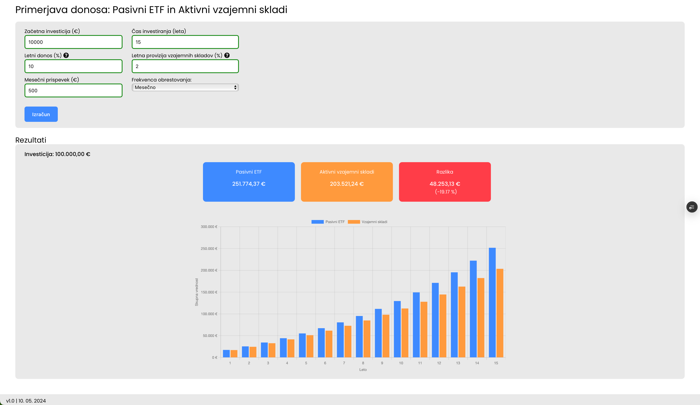

# 📊 Grafični primerjalnik: Pasivni ETF-ji vs Aktivni vzajemni skladi

## 🎯 Namen
Program prikazuje grafično primerjavo med pasivnimi ETF-ji na eni strani in aktivno vodenimi vzajemnimi skladi na drugi. Namen je pokazati, kako nam videz majhne letne upravljalske provizije (2-3%) pri aktivno vodenih vzajemnih skladih zmanjšujejo potencialne dobičke na dolgi rok.

## 📝 Opomba
Čeprav so stroški tudi pri pasivnih ETF-jih (običajno med 0,07% in 0,2%), sem te stroške v programu ignoriral in predpostavili, da so 0%. To predvsem zaradi dejstva, da so ti stroški bistveno manjši v primerjavi z upravljalskimi provizijami pri aktivnih vzajemnih skladih.

## 🌐 Povezava do aplikacije:
Aplikacijo je na voljo tukaj:  
[ETF vs. Vzajemni skladi](https://etf-vs-vzajemni-skladi.vercel.app)

## 🖥 Zagon projekta lokalno
- Kloniramo projekt:  
  `git clone https://github.com/Zankooo/React-investing.git`

- Ker je projekt zgrajen z uporabo React frameworka, moramo nastaviti okolje:  
  `npm install`

- Nato zaženenemo aplikacijo z ukazom:  
  `npm start`

Vsaka sprememba v projektu bo samodejno osvežila stran. 🔄

## 📸 Posnetek zaslona aplikacije

